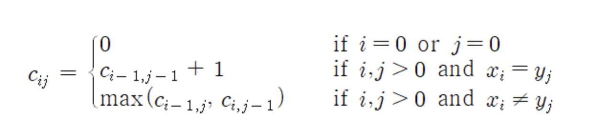

## 백준 9251 LCS

### 알고리즘

```txt
 ✅ 동적계획법
 ✅ LCS 구하는 공식 (아래 사진 참고)
```



### 코드 구현

사용 언어 : **파이썬**

```python
str1=list(input())
str2=list(input())

dp=[[0 for _ in range(len(str2)+1)]for _ in range(len(str1)+1)]

for i in range(1,len(str1)+1):
    for j in range(1,len(str2)+1):
        if str1[i-1]==str2[j-1]:
            dp[i][j]=dp[i-1][j-1]+1
        elif str1[i-1]!=str2[j-1]:
            dp[i][j]=max(dp[i-1][j],dp[i][j-1])

print(dp[-1][-1])

```
